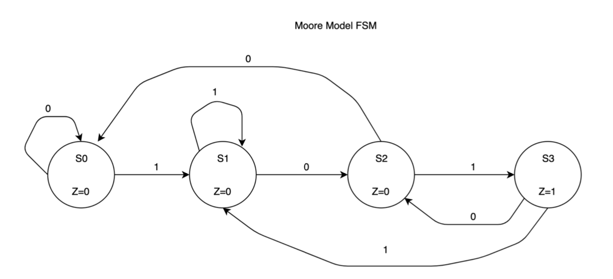

# Sequence Detector 
## Design and implement a 101 sequence detector using verilog

Moore FSM for 101 Sequence detector is given below:

States are as follows:

     S0-> Reset state
     S1-> Received 1
     S2-> Recieved 10
     S3-> Received 101

The design is parameterized. Design include three always blocks: for reset logic, for next state logic and for output display.

The testbench uses different tasks for testing. Tasks are called at the end of the fixture in main() task. 
